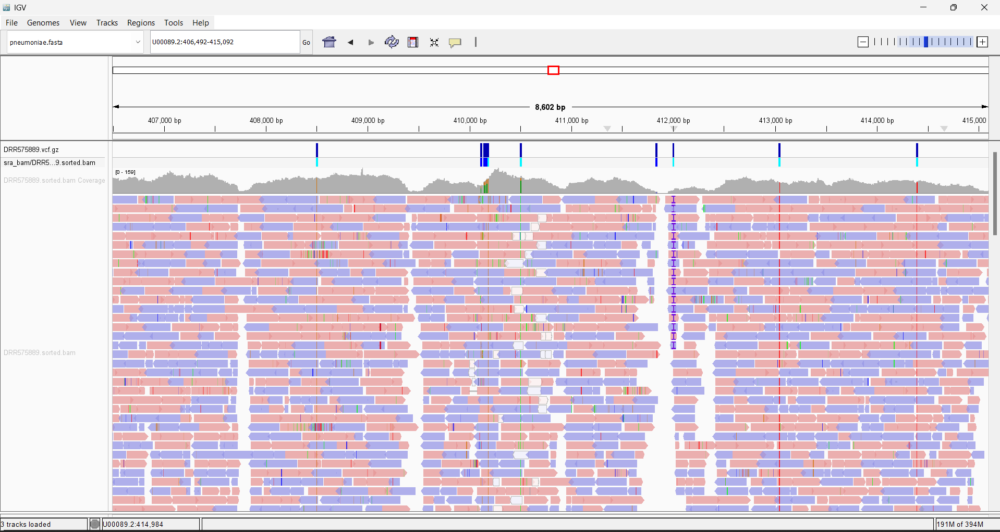

## Week 10 Homework: Generate a Variant Call File

### Producing VCF for Mycoplasmoide pneumoniae M129

The sample data that was used has the SRR number DRR575889.

The reference genome that the variants were called against was U00089.2.

The variables used in the makefile code in the generation of the file are below.

```
#SRR number for the Illumina run being analyzed
SRR=DRR575889

#Directory for the FASTQ reads to be saved into
READS=reads

#Desired number of reads for quality analysis 
NUM=250000

#Directory for the FASTQC reports to be saved into
REP=reports

#Directory for the trimmed files to be saved into
TRIM=trimmed

#Directory for the reference genome to be saved into
DIR=refs

#Reference genome for the alignment
REF=U00089.2

#Name of reference genome
NAME=pneumoniae

#Directory for the SRA BAM files to be saved into
BAM2=sra_bam

#Resulting variant VCF File (compressed)
VCF=DRR575889.vcf.gz
```
The following code was used to download the SRA data, convert to fastq format and perform quality control on the data.

```
prefetch ${SRR}

mkdir ${READS}

fastq-dump -X ${NUM} --outdir ${READS} --split-files ${SRR}

mkdir ${TRIM}

fastp --cut_tail -i ${READS}/${SRR}_1.fastq -o ${TRIM}/${SRR}_1.trimmed.fastq -I ${READS}/${SRR}_2.fastq -O ${TRIM}/${SRR}_2.trimmed.fastq
```

To download and index the reference genome the following code was used.

```
mkdir ${DIR}

bio fetch --format fasta ${REF} > ${DIR}/${NAME}.fasta

bwa index ${DIR}/${NAME}.fasta
```

The code to align the SRA data to the reference genome and then run alignment stats on the resulting bam file.

```
mkdir ${BAM2}

bwa mem ${DIR}/${NAME}.fasta ${TRIM}/${SRR}_1.trimmed.fastq ${TRIM}/${SRR}_2.trimmed.fastq > ${SRR}.sam

samtools view -S -b ${SRR}.sam > ${BAM2}/${SRR}.bam

samtools sort ${BAM2}/${SRR}.bam -o ${BAM2}/${SRR}.sorted.bam

samtools index ${BAM2}/${SRR}.sorted.bam

samtools flagstat ${BAM2}/${SRR}.sorted.bam
```

Finally, the variant call file was produced using the toolbox code that was provided from the AI Powered Bioinformatics Course. The code below will only work if the toolbox is installed.

```
make -f src/run/bcftools.mk REF=${DIR}/${NAME}.fasta BAM=${BAM2}/${SRR}.sorted.bam VCF=${VCF} run
```
### Visualizing the Called Variants in IGV

The image below is a screenshot of the IGV screen encompassing approximately 8.6kb of the genome. Deeper analysis of the individual variants is given in the section below



### Analysis of the Variants called in IGV

#### SNP called at Postion 408,503

The reference genome at this position has an A, however the variant called is a G in place of it. I would confidently call this a SNP because the depth is over 90 and all of the reads that overlapped at this position had the G rather than an A. 

#### SNP called at Position 410,116

The original base was an A at this position while the variant called is a G. However, the majority of the reads still are the native A, so while it might be a SNP, I would not confidently call it a SNP and it is more likely a false positive. 

#### SNP called at Position 410,164

The native base is an A while the variant that was called is a G. 34% of the reads were the variant G, so I would say that because it is more than 1% of the reads, this could be a valid SNP, however it would not be as confident a SNP, which would be a similar situation to the SNP called at 410,116. 

#### SNP called at Position 410,505

The reference genome contains a G, however the variant that was called was an A. This does appear to be a valid SNP as 80% of the reads contained the A. However, there still are 18 reads that contain the native G base. 

#### SNP called at Position 411,838

The reference genome contains a C, however a variant SNP was called with an A. Visually, this does not appear to be a valid SNP because the depth is labeled as 8, and scrolling through the reads at that point, I only see two reads that contain an A. This is likely a false positive. 

#### INDEL called at Position 412,003

While the reference contains a T at this position, the variant that was called contains a TA sequence. While each of the reads called this sequence at that position, only 17 reads overlaped here. This is likely a valid variant, however with lower confidence.

#### SNP called at Position 413,046

The original base was a C and the variant base is a T that was called with a depth of 69. Visually, looking at the SNP called, all reads that overlap at that position contain a T, indicating this is likely a valid variant.

#### SNP called at Position 414,396

The initial reference genome had a G whereas the alternate base is a T which was called with a depth of 67. The reads showing on IGV that overlap at that position all have T's except for one, indicating that this is likely a variant. 
