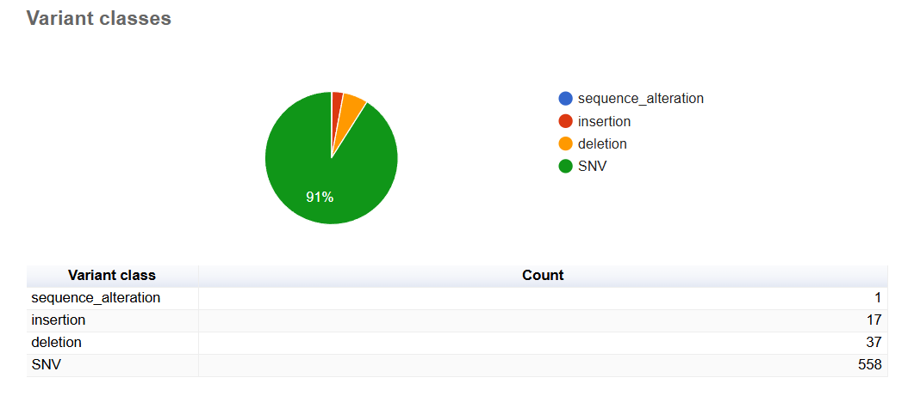

## The Makefile used to call variants in VCF file and using Variant Effect Prediction software

The makefile that I used to produce the files to analyze the effects of variants was derived from Dr. Albert's code included in the AI powered Bioinformatics lesson.

Included in the Makefile in the Week11 folder is the code that was utilized. Important to keep in mind is that the bioinformatics toolbox needs to be downloaded prior using

```
bio code
```

The organism that I analyzed was the *Plasmodium falciparum* NF54 strain. 

The genome accession number was GCA_012898025.1
The sample sequencing read accession number was SRR27748157

## Results from running VEP on the variants called on the *P. falciparum* NF54 sample

Overall, there were 613 variants processed throughout the genome data, of which the majority were SNVs. 



The three most common types of consequence type were missense variants, and downstream and upstream gene variants. 


Finally, the chromosome of *P. falciparum* NF54 that had the most variants called in this sample was QFXU01000012.1 with 97 variants along approximately 3,300 kb. And the chromosome with the least variants of 6 was QFXU01000018.1 along 306 kb. 


