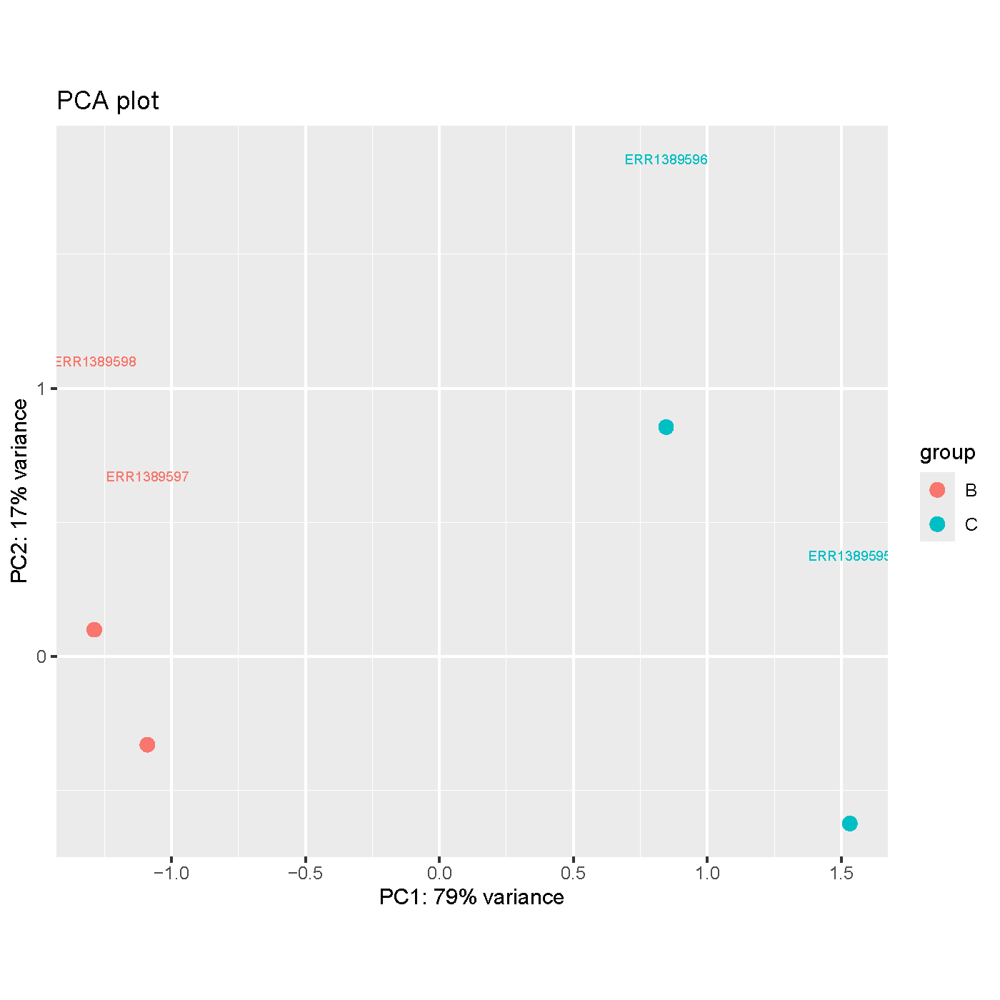
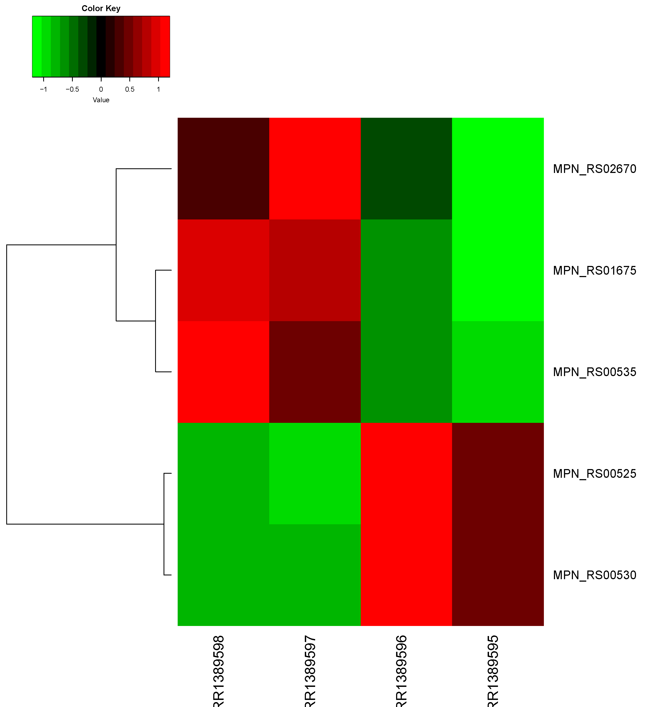

## Perform a Differential Expression Analysis

### Samples Used for Analysis

From project "Transcriptome analysis of Mycoplasma pneumoniae III" (PRJEB13760) 

- ERR1389598
- ERR1389597
- ERR1389596
- ERR1389595

Where *98 and *97 are replicates and *96 and *95 are replicates.

### Generation of Count Matrix

The count matrix generated can be found under the "output_files" directory. There were a total of 43 genes that were called. With the highest read counts around 150000 and the losest being 0. 

### Differential Expression Analysis

After analysis there were 31 genes removed due to low expression and of the 12 remaining, 6 were found to be statistically significant from the p-value threshold and 5 were left after the false discovery rate application. 

### PCA Plot

The replicate groups separate pretty clearly on the pca plot, indicating the similarities between the replicates and the differences between the different samples. 

### Heatmap Plot

There is a reverse relationship between the groups. For example, while the bottom genes have higher expression in *98 and *97, the other two samples see a lower expression. There also appears to be more variation between replicates of the top three genes, yet the general pattern of differences between groups remains. 

