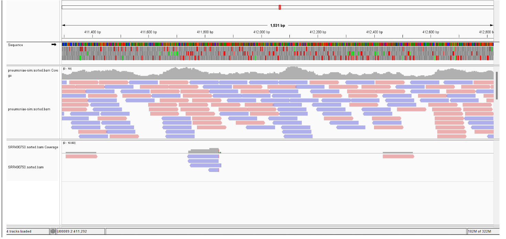

This is the same information included in the file labeled hwk8.md

# Visualizing simulated and SRA data BAM files

Below is a screenshot of the reference sequence and the aligned simulated reads (top) and experimental SRA reads (bottom) for *Mycoplasmoide pneumoniae*

# Ran Alignment Stats on Simulated and Experimental Reads

## Stats from Simulated Reads
- 120002 + 0 in total (QC-passed reads + QC-failed reads)
- 120000 + 0 primary
- 0 + 0 secondary
- 2 + 0 supplementary
- 0 + 0 duplicates
- 0 + 0 primary duplicates
- 119539 + 0 mapped (99.61% : N/A)
- 119537 + 0 primary mapped (99.61% : N/A)
- 20000 + 0 paired in sequencing
- 60000 + 0 read1
- 60000 + 0 read2
- 119370 + 0 properly paired (99.48% : N/A)
- 119470 + 0 with itself and mate mapped
- 67 + 0 singletons (0.06% : N/A)
- 0 + 0 with mate mapped to a different chr
- 0 + 0 with mate mapped to a different chr (mapQ>=5)

### Key Notes from Simulated Stats
None of the simulated reads failed quality control and there were no duplicate reads. Over 99% of the reads mapped to the reference genome and the reads were sequenced in pairs.

## Stats from SRA Data
- 7688 + 0 in total (QC-passed reads + QC-failed reads)
- 7688 + 0 primary
- 0 + 0 secondary
- 0 + 0 supplementary
- 0 + 0 duplicates
- 0 + 0 primary duplicates
- 5447 + 0 mapped (70.85% : N/A)
- 5447 + 0 primary mapped (70.85% : N/A)
- 0 + 0 paired in sequencing
- 0 + 0 read1
- 0 + 0 read2
- 0 + 0 properly paired (N/A : N/A)
- 0 + 0 with itself and mate mapped
- 0 + 0 singletons (N/A : N/A)
- 0 + 0 with mate mapped to a different chr
- 0 + 0 with mate mapped to a different chr (mapQ>=5)

### Key Notes from SRA Stats
All of the reads passed quality control of which only 70% mapped to the reference genome. In addition, there were no duplicate reads and the reads from the sequencing were not paired.

## Biggest Differences Between Simulated and Experimental Reads
Some of the biggest differences between the two alignments based on the stats generated are below.

- The SRA data had less reads available from the bam file, with less than 8000 reads compared to the simulated 120000.
- While 99% of the simulated data mapped to the reference genome, only 70% of the SRA data did. This makes sense as I did not include any mutations or a large error rate in my simulated data.
- The simulated data was sequenced in pairs, but the SRA data did not appear to be done as such. 
